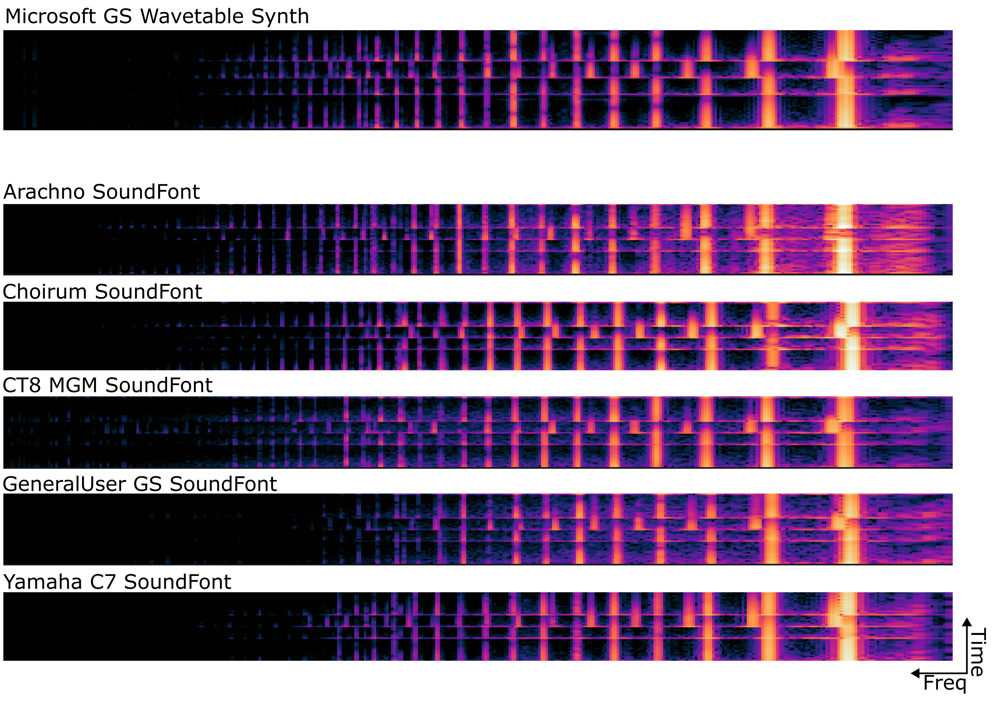

# 🎹 midi2wav-batch
Convert MIDI scores to audio files in one script!  
Uses your Windows computer's built-in sound source - no additional software required.

- Function: Batch convert MIDI files to WAV audio
- Audio Source: Microsoft GS Wavetable Synth (Windows built-in)
- Output Format: 16-bit PCM WAV, 44.1kHz stereo

This tool requires a virtual audio driver to capture system audio output.  
- Recommended: VB-Audio Virtual Cable 
- Official Download: https://vb-audio.com/Cable/

### 📚 Additional Resources

| Solution            | Platform       | Audio Quality      | Speed        | Setup       | Best For        |
|---------------------|----------------|--------------------|--------------|-------------|-----------------|
| midi2wav-batch      | 🪟        | Good (GM Synth)    | Slow-Medium       | Simple      | Quick conversions|
| [ReaRender](https://github.com/YatingMusic/ReaRender)                                                        | 🍎🪟      | Excellent (VSTs)    | Medium         | Complex     | Professional work|
| [RenderMan](https://github.com/ethman/slakh-generation?tab=readme-ov-file#step-1-setting-up-renderman-on-mac)| 🍎        | Excellent (VSTs)             | Medium         | Complex     | Professional work|
| [FL Studio Export](https://www.youtube.com/watch?v=iAi0016kAL8)                                              | 🪟         | Excellent (VSTs)    | Medium         | Moderate    | Music production |
| [FluidSynth](https://github.com/FluidSynth/fluidsynth)                                                       | 🪟🍎🔳    | Medium (SoundFont) | Fast           | Simple      | Quick conversions|

Know a better solution? Let me know!
